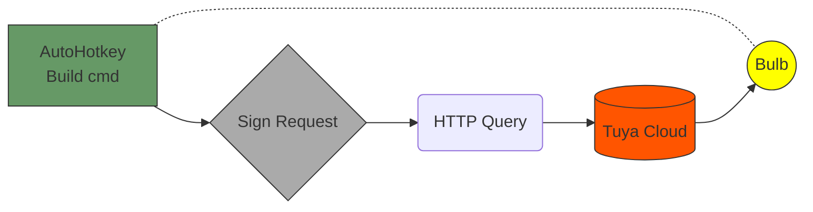
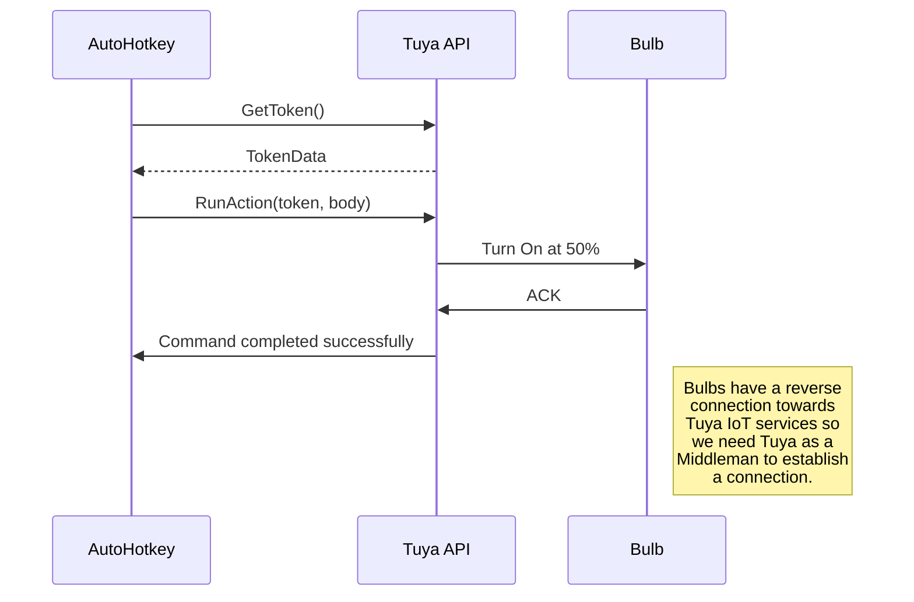

# Tuya IoT OpenAPI Wrapper for AutoHotkey 

I had some wifi bulbs that I was given like 5 years ago or so and I wanted to automate them with **AutoHotkey**.
I noticed they were using **port 6668**, so chances were they could use **Tuya API** and since there was no ahk library for dealing with them I made my own.

Now I've read Tuya is known for changing their API a lot and __making it hard on purpose__ for users to deal directly with their IoT devices (which was my idea in the first place). However, ***this is working as of 15/Feb/2024.***

## Connection Flow:



## Class Usage

### Initializing the class and obtaining a *Token*
```AutoHotkey
tuyaApi := new TuyaApi()
tuyaApi.getToken()
tuyaApi.cfg.debug := 1 ; Get notified of errors (off by default)
```
> **Quick Note:** getToken is not always necessary since this lib is able to detect invalid or deprecated tokens and **recreate a valid token** on its own when **performing an action**.

### Performing actions on the devices
```AutoHotkey
; Turn on light
tuyaApi.toggleOn(tuyaApi.devices[1].id, "true") ; Returns status 200 if successful

; Turn off light
tuyaApi.toggleOn(tuyaApi.devices[1].id, "false")

; Turns on light, sets luminosity to 1000 (max [10-1000]) and warmness to 0 (warmest [0-1000])
tuyaApi.setNormalLightStatus(tuyaApi.devices[1].id, "true", "1000", "0")

; Turns on light, sets HSV values to: h:240 -> blue, saturation -> 1000, value -> 1000
tuyaApi.setHSVLightStatus(tuyaApi.devices[1].id, "true", "240", "1000", "1000")
```

### Getting device information
```AutoHotkey
bulb1_info := tuyaApi.getDeviceInfo(tuyaApi.devices[1].id) ; Get info of a specific device
devices_info := tuyaApi.getDevicesInfo(tuyaApi.devices) ; Get info of each registered device
bulb1_stats := tuyaApi.getDeviceStats(tuyaApi.devices[1].id) ; Get stats of a scpecific device
devices_stats := tuyaApi.getDevicesStats(tuyaApi.devices) ; Get stats of each registered device
```

## Configuration Example
### common_data.json
```JSON
{
  "debug": false,
  "url": "https://openapi.tuyaeu.com",
  "client_id": "9647axf8vtyuqtwugjnd",
  "secret": "aa75b183b4v757aba8db85u8945c7acf",
  "project_code": "p1807878438912hout6r"
}
```

### devices.json
```JSON
[
  {
    "type": "bulb",
    "name": "Smart Bulb",
    "id": "07468567f4cfa678542d",
    "product_id": "1urlnfjaiklk4dly"
  },
  {
    "type": "bulb",
    "name": "Smart Bulb 2",
    "id": "03740273f4cfa2289311",
    "product_id": "irsteipfgt0kt7rco"
  }
]
```

## Detailed connection flow:


## Notes
I have implemented but not yet used **refresh tokens**, feel free to improve this library by doing a pull request.

I **do not have nor automate IoT stuff myself** nor I tend to create AutoHotkey libs for others (I'm more and more leaning towards doing so though lately because I'm planning to **make Udemy Courses or video content** on AutoHotkey development), so any suggestion is greatly appreciated.

This project was written with AutoHotkey v1 in mind, if you want to port it to AHK v2 or want some advise on it, you can find me on Discord.
